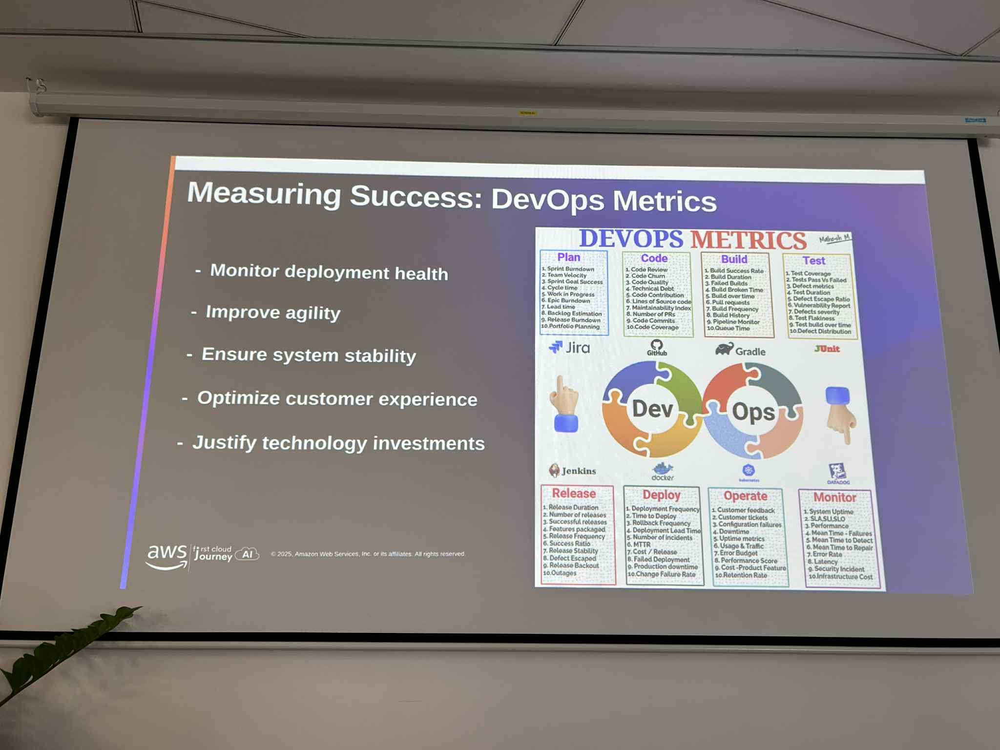

# Summary Report: “DevOps on AWS Workshop”

### Event Objectives

- Understand the DevOps culture, principles, and key performance metrics (DORA).
- Master the AWS Developer Tools suite to build automated CI/CD pipelines.
- Learn Infrastructure as Code (IaC) using AWS CloudFormation and CDK.
- Explore Container services (ECS, EKS, App Runner) and Observability tools (CloudWatch, X-Ray).

### Speakers

- **AWS Solutions Architects Team** (Vietnam)

### Key Highlights

#### DevOps Mindset & CI/CD Services
- **Metrics Matter:** The session started by emphasizing DORA metrics (Deployment Frequency, Lead Time, etc.) to measure DevOps success.
- **Pipeline Automation:** Detailed walkthrough of the full pipeline:
    - **Source:** CodeCommit & Git strategies (Trunk-based vs. GitFlow).
    - **Build & Test:** Using CodeBuild for compiling and running unit tests.
    - **Deploy:** Strategies like Blue/Green and Canary using CodeDeploy to minimize downtime.
    - **Orchestrate:** Binding everything together with CodePipeline.

#### Infrastructure as Code (IaC)
- **CloudFormation vs. CDK:** A clear comparison between defining infrastructure via JSON/YAML templates (CloudFormation) versus using familiar programming languages like TypeScript/Python (CDK).
- **Drift Detection:** How to detect if the actual infrastructure has deviated from the code definition.

#### Container Services
- **Choosing the Right Tool:** Guidance on when to use **Amazon ECS** (simpler, AWS-native) vs. **Amazon EKS** (Kubernetes standard) vs. **App Runner** (fully managed/simplest).
- **Registry:** Using Amazon ECR for secure image storage and vulnerability scanning.

#### Observability
- **Full-stack Visibility:** It’s not just about logs. It’s about correlating Metrics, Logs, and Traces (using AWS X-Ray) to debug distributed microservices effectively.

### Key Takeaways

#### Automation is King
- Manual deployments are error-prone. The goal is to automate everything from infrastructure provisioning (IaC) to code deployment (CI/CD).

#### Immutable Infrastructure
- Through the Container session, I learned the value of immutable infrastructure—packaging the app and its dependencies into a Docker container ensures it runs the same way everywhere.

#### Shift Left
- Testing and security scanning should happen early in the pipeline (in CodeBuild/ECR), not after deployment.

### Applying to Work

- **Refactor Pipeline:** I will attempt to implement a "Blue/Green" deployment strategy for my current internship project using CodeDeploy to ensure zero downtime.
- **Try AWS CDK:** Instead of clicking through the console, I will write a CDK script to provision the VPC and EC2 for the next task.
- **Enable X-Ray:** I plan to instrument my application to send traces to AWS X-Ray to visualize service maps and latency bottlenecks.

### Event Experience

The **"DevOps on AWS"** full-day workshop was comprehensive and connected many dots for me.

#### From Theory to Practice
The transition from explaining the **DevOps Mindset** in the morning to actually configuring a **CI/CD Pipeline** helped me understand *why* we use these tools, not just *how*.

#### The "Container" Clarity
I used to be confused between ECS and EKS. The breakdown in the afternoon session clarifying that ECS is for "AWS-opinionated" orchestration and EKS is for "Kubernetes-standard" orchestration was very helpful.

#### Interactive Demos
The demo on **Full-stack observability** using CloudWatch and X-Ray was an eye-opener. Seeing a request traced from the load balancer down to the database query showed the power of modern monitoring.

#### Some event photos
    

> Overall, this event provided the essential toolkit for a modern Cloud Engineer: CI/CD, IaC, Containers, and Monitoring.